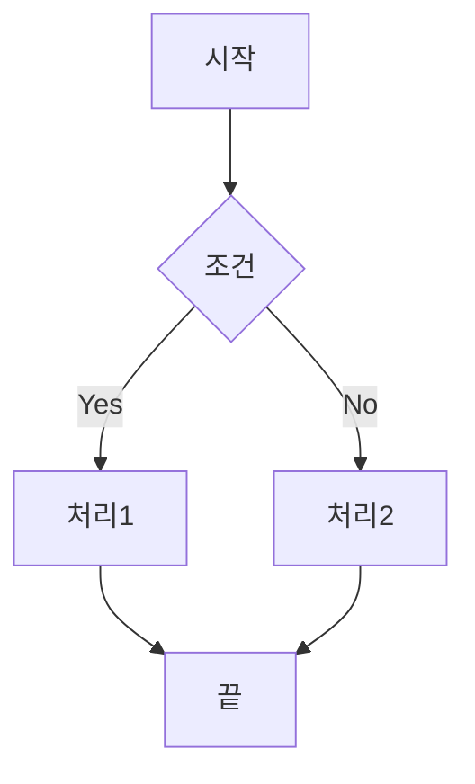
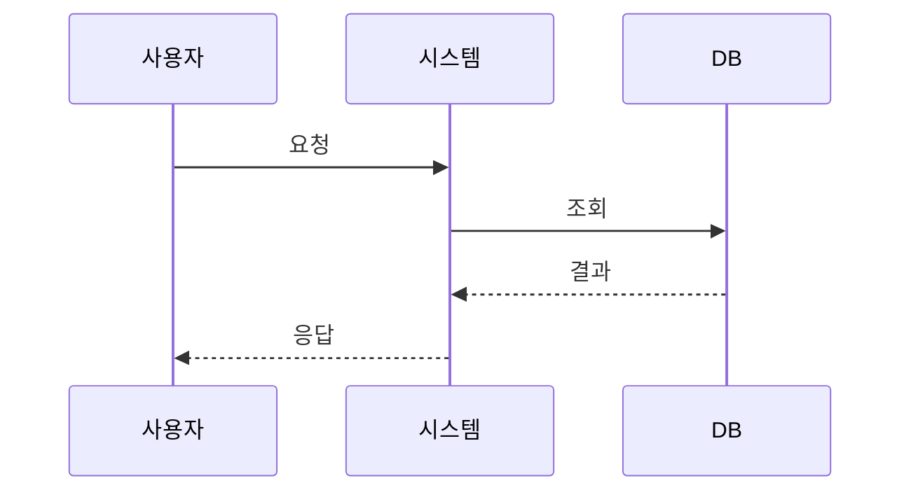
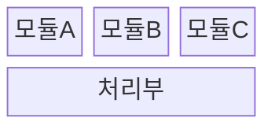
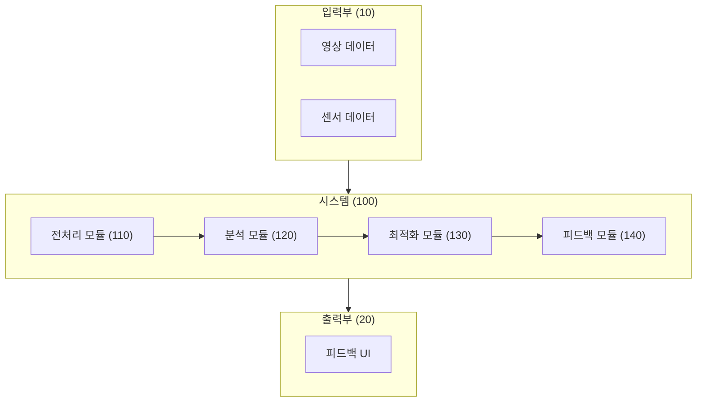
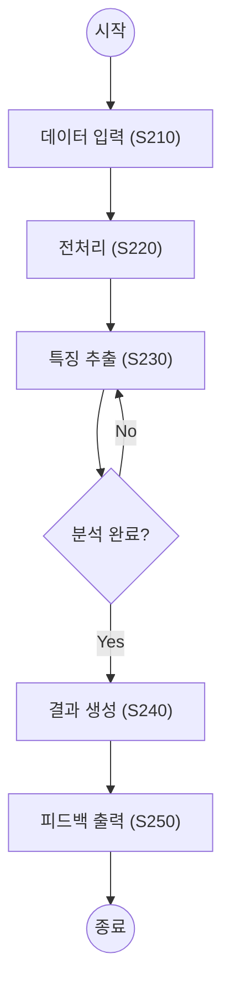
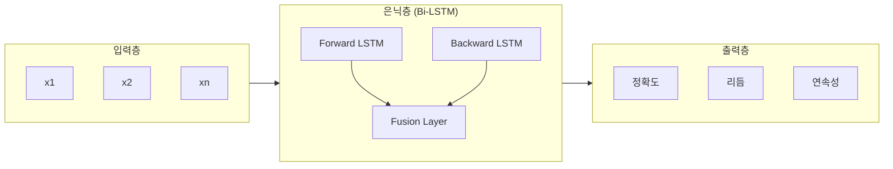
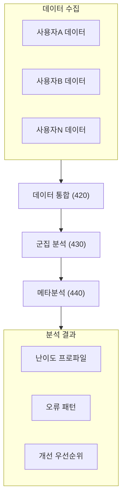
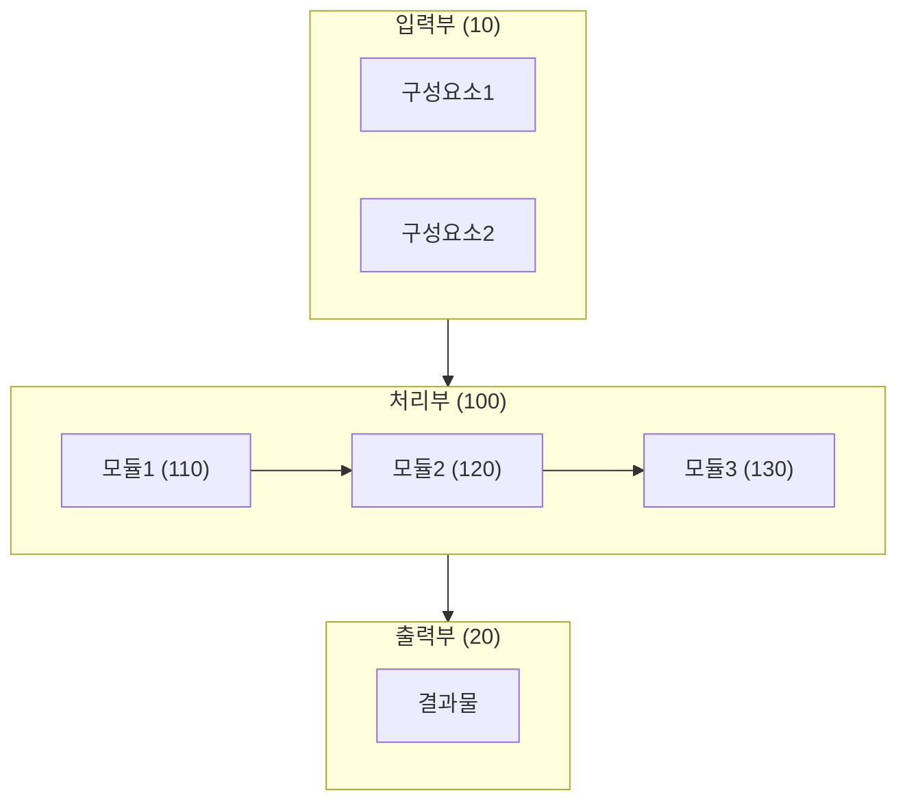
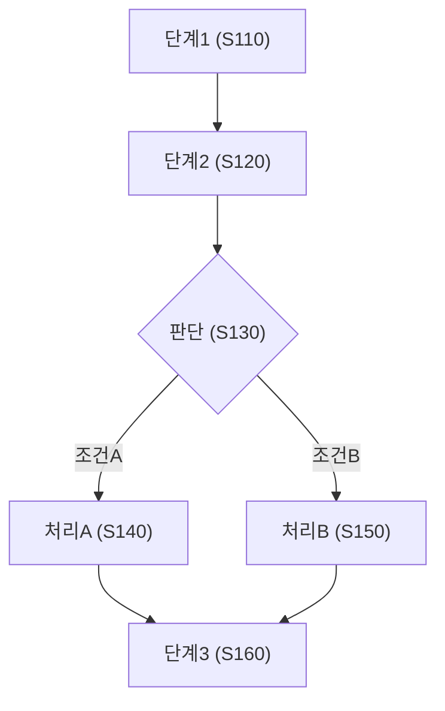
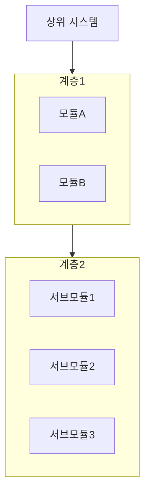

# Mermaid 기반 특허 도면 자동화

Mermaid 문법으로 특허 도면을 자동 생성하는 가이드입니다.

---

## Mermaid 기본 문법

### 1. 플로우차트 (가장 많이 사용)



### 2. 시퀀스 다이어그램



### 3. 블록 다이어그램 (시스템 구성도)



---

## 특허 도면 템플릿

### 도 1. 전체 시스템 구성도



### 도 2. 처리 플로우



### 도 3. 신경망 구조



### 도 4. 데이터 흐름



---

## 사용 방법

### 1. GitHub/GitLab에서 렌더링

GitHub README.md에 Mermaid 코드 블록을 추가하면 자동 렌더링됩니다.

````markdown

````

### 2. Mermaid Live Editor

온라인에서 즉시 미리보기 및 이미지 다운로드:
- https://mermaid.live

### 3. VS Code 확장

- **Markdown Preview Mermaid Support** 설치
- Markdown 파일에서 미리보기

### 4. CLI 도구로 이미지 변환

```bash
# 설치
npm install -g @mermaid-js/mermaid-cli

# PNG 변환
mmdc -i diagram.mmd -o diagram.png -b white

# PDF 변환
mmdc -i diagram.mmd -o diagram.pdf

# SVG 변환
mmdc -i diagram.mmd -o diagram.svg
```

---

## 특허 도면 자동 생성 프롬프트

Claude에게 다음과 같이 요청하세요:

```
발명의 구성요소:
- 입력부: 영상 데이터 수신
- 처리부: AI 분석
- 출력부: 피드백 제공

위 구성요소로 특허 도면용 Mermaid 다이어그램을 생성해줘.
도면 부호(100, 110, 120...)를 포함해서.
```

---

## 특허청 제출용 변환

### Mermaid → 이미지 → 특허 도면

1. **Mermaid 코드 작성**
2. **PNG/SVG로 내보내기**
3. **이미지 편집** (필요시)
   - 흑백 변환
   - 부호 추가/수정
   - 해상도 조정 (300 DPI)
4. **TIFF로 변환** (특허청 권장)

### 이미지 변환 명령어

```bash
# ImageMagick 사용
convert diagram.png -colorspace Gray -density 300 diagram.tif
```

---

## 템플릿 모음

### 시스템 구성도 템플릿



### 방법 플로우 템플릿



### 계층 구조 템플릿



---

## 부호 규칙

| 부호 범위 | 용도 |
|-----------|------|
| 10~19 | 입력부 |
| 20~29 | 출력부 |
| 100~199 | 메인 시스템/장치 |
| 110~119 | 제1 모듈 |
| 120~129 | 제2 모듈 |
| S100~S199 | 방법 단계 |
